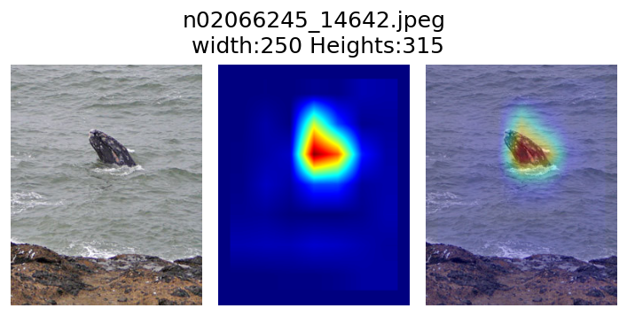

# Pytorch_GradCam
Pytorch GradCam with ResNet50

## Inference 
1. open display_notebook.ipynb
2. Run all cells
3. You will see a img heatmap and mixup img

## GradCam_model.py
- Here is a ResNet50 class with GradCam function

## Result Img
